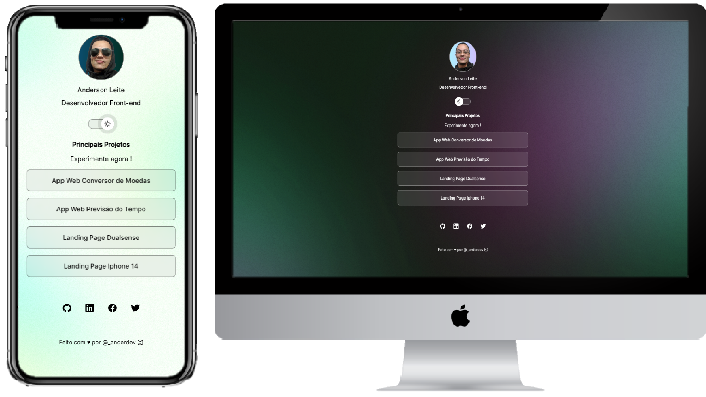

[Projeto ONLINE, experimente agora](https://anderdev-github.github.io/Portfolio-Anderson-Leite/)  

<h3 align="center">
  Seja bem-vindo ao projeto do meu portfólio!
</h3>

 

  <a href="#house-Sobre-o-projeto">Sobre o projeto</a>&nbsp;&nbsp;&nbsp;|&nbsp;&nbsp;&nbsp;
  <a href="#computer-Tecnologias">Tecnologias</a>&nbsp;&nbsp;&nbsp;|&nbsp;&nbsp;&nbsp;
  <a href="#balance_scale-Licença">Licença</a>&nbsp;&nbsp;&nbsp;|&nbsp;&nbsp;&nbsp;
  <a href="#man_technologist-Autor">Autor</a>&nbsp;&nbsp;&nbsp;|&nbsp;&nbsp;&nbsp;

 

 

## :house: Sobre o projeto

Meu projeto especial é meu próprio portfólio, que foi feito com muito carinho e dedicação. Cada detalhe, desde as fontes até os projetos selecionados, foi escolhido com cuidado para representar minha personalidade e meu estilo de trabalho. Meu objetivo é apresentar minhas habilidades como desenvolvedor e criar uma experiência agradável para quem visitar meu portfólio. Espero que gostem do resultado!

## :computer: Tecnologias

-  : Utilizado para estruturar a página web, definindo os elementos, tags e suas respectivas funções.
-  : Utilizado para estilizar a página, definindo as cores, fontes, tamanhos e posições dos elementos. Além disso, ele foi usado para integrar pequenas animações de transições de links e botão de escolha de tema.
-  : Ultilizado para criar duas funções responsável por alternar o modo claro e escuro da página de portfólio quando o usuário clica no botão de mudança de tema. Ao ser acionada, a função busca o elemento raiz do documento HTML e adiciona ou remove a classe 'light', que é responsável por aplicar a estilização do modo claro ou escuro. Além disso, a função também altera a imagem do perfil, trocando entre a imagem com fundo claro e a imagem com fundo escuro, de acordo com o tema. Essas funções foram adicionadas para oferecer uma experiência mais agradável e personalizada para os usuários, permitindo que possam escolhe o tema que melhor te agrada.

## :balance_scale: Licença

Este projeto é de código aberto e está sob a licença Licença MIT. Você é livre para usar, modificar e distribuir este projeto de acordo com os termos da licença.

## :man_technologist: Autor

Feito com ♥ por Anderson Leite :wave: [Entre em contato!](https://www.linkedin.com/in/andersondiasleite/)
